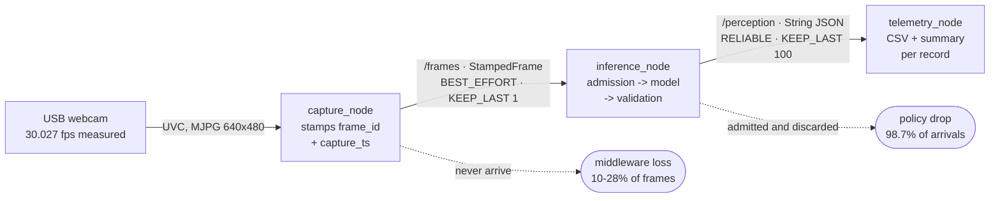

# Architecture

## The problem this system solves

A camera produces frames at a rate the model cannot match. Offered load is
~30 frames/second; a multimodal model on an 8 GB Jetson services frames on
the order of hundreds of milliseconds. The system is therefore in permanent
overload by an order of magnitude, and that is the normal operating
condition, not an exceptional one.

The design question is not "how do we go faster". It is **which frames get
served, how old the answer is when it arrives, and what the consumer is told
when something goes wrong.**

Gate 1 measurements so far: Jetson Orin Nano Super, JetPack 6.2 / L4T 36.4.3,
`nvpmodel` mode 0 (15W), camera delivering a measured 30.027 fps.

## Dataflow

```
  USB webcam  (measured 30.027 fps, not the 30 the descriptor claims)
      |
      |  capture thread: stamps trusted frame_id + monotonic capture_ts
      v
  admission policy         <-- LatestFrameBuffer: capacity 1, newest wins
      |                        (baselines: BoundedFifo, UnboundedFifo)
      |  ~~~ thread boundary: capture never blocks on inference ~~~
      v
  preprocess               <-- fixed resolution, fixed colour order, timed stage
      |
      v
  model inference          <-- untrusted; runs at whatever rate is sustainable
      |                        per-frame deadline enforced inside generation
      v
  schema validation        <-- 6-way failure taxonomy; no retries
      |
      v
  metadata attachment      <-- TRUSTED frame_id + 4 monotonic timestamps
      |
      v
  structured JSON output   <-- explicit unknown states, always well-formed
      |
      v
  mock consumer            <-- logger / dashboard. Nothing safety-flavoured.

  telemetry taps: queue age, inference latency, post-processing, result age,
                  drop rate, invalid-output rate, extraction rate, RSS, power,
                  health state
```

## ROS 2 topology, and the one QoS decision that matters

The dataflow above is the logical pipeline. Deployed, it is three nodes, and
the interesting part is that the two topics are configured as opposites.



| topic | reliability | depth | why |
| --- | --- | --- | --- |
| `/frames` | BEST_EFFORT | 1 | A stale frame has negative value, so losing one is the design rather than a cost. |
| `/perception` | RELIABLE | 100 | A lost *record* removes a sample from the distribution being measured. Results arrive every 6 s against a queue of 100, so reliability is free here. |

**The trap worth knowing.** A RELIABLE subscriber does not merely lose frames
against a BEST_EFFORT publisher -- it never connects at all. The QoS profiles
are incompatible, so the subscriber sits receiving nothing while every process
involved looks healthy and `ros2 node list` shows both. Diagnose it with
`ros2 topic info -v`, which prints each endpoint's profile.

**Two losses, two names.** Frames disappear twice over and reporting one
number would blame the middleware's losses on a design decision:

- **Middleware loss**, 10-28%, before the policy ever sees the frame. The
  board cannot deserialise 30 x 921,600 bytes per second, so DDS drops them.
  Recovered from gaps in the trusted `frame_id` sequence, which is why that
  field is stamped by the publisher rather than inferred downstream.
- **Policy drop**, 98.7% of what arrives. Deliberate: capacity-1 overwrite,
  newest frame wins.

The rate is not stable, either, which is itself worth recording: middleware
loss fell from 28% to 10% over one twelve-minute run as the process settled,
with no change in configuration. A single number quoted from the first minute
would have been wrong by a factor of three.

## The trust boundary

This is the single most important line in the system, and it runs between
`RawModelOutput` and `PublishedResult` in `inference/record.py`.

**The model emits semantic content and nothing else.** It does not emit
identifiers, it does not emit timestamps, and it does not emit confidence.

- **`frame_id` is trusted metadata.** It is assigned by the capture stage and
  carried *alongside* the model, never *through* it. If the model were the
  source of the identifier used for latency accounting, a hallucinated or
  mangled value would silently mis-attribute a result to the wrong capture.
  The corruption would not look like a bug. It would look like jitter, and it
  would be measured, plotted and believed.
- **Every timestamp comes from one monotonic clock** (`inference/clock.py`).
  Wall-clock time is recorded once per record, for humans, and is never
  subtracted from anything. An NTP step correction mid-inference would
  otherwise corrupt a duration or make it negative.
- **Confidence is not in the schema.** A VLM emitting `"confidence": "high"`
  has produced a token, not a calibrated probability. Publishing it would
  invite a consumer to threshold on a number that means nothing. Such keys
  are stripped and counted, not forwarded.

Validation sits exactly on the boundary: nothing downstream of
`inference/schema.py:validate` reads model text.

## Admission policy, not backpressure

The term matters. **Backpressure** slows the producer. A camera cannot be
slowed; it delivers frames at its own rate whether or not anything is ready to
receive them. The only lever is deciding which frames to admit and which to
discard, which is an **admission and drop policy**.

Three policies are implemented (`inference/buffer.py`), sharing one interface
so an experiment can swap between them with nothing else changing:

| policy | on overload | result age | drop rate |
|---|---|---|---|
| `latest` | newest frame evicts the pending one | ~ one service time | high, and rising with overload ratio |
| `fifo_bounded(n)` | tail-drop: the incoming frame is refused | saturates near `(n + 1) x service time` | high |
| `fifo_unbounded` | never drops | grows without bound | zero |

`latest` is the design choice. For this workload a stale frame has
**negative** value, because the consumer cannot tell a 3-second-old view from
a current one by reading the semantics. Discarding stale work is the correct
behaviour, and the resulting drop rate is the design working, so it is
reported as a headline number.

`fifo_unbounded` is a **pathological baseline**, labelled as one everywhere it
appears, so the claim "result age grows without bound" attaches to the one
configuration where it is literally true. A bounded FIFO fills and then drops,
so its age is capped by capacity. Stating otherwise would be an overclaim.

Queue *depth* is not reported. In a one-slot buffer it is 0 or 1 and carries
no information. Queue **age** is the informative quantity.

## Threading model

Three threads, no shared mutable state outside two locks:

- **capture thread**: acquires a frame, stamps it, calls `policy.offer()`,
  returns. Bounded work only. `test_capture_is_not_blocked_by_a_slow_engine`
  pins this.
- **inference worker**: `policy.take()` -> preprocess -> engine -> validate ->
  attach -> publish. One at a time. Concurrency would not help here. A single
  model on a single GPU is the serial resource, and overlapping invocations
  would trade result age for throughput in the wrong direction.
- **watchdog**: observes time since last publish and sets a health state. It
  reports; it does not restart. Automatic restart would hide the failures this
  project exists to show.

The worker outlives anything that happens to one frame: a raising consumer is
isolated and counted, and a crash in our own stages publishes a
`pipeline_error` record. A worker dying on the first unexpected exception
would be the same silent failure the output contract exists to rule out.

If capture and inference shared a thread, the camera driver's own buffering
would become the queue, and the admission policy would have nothing left to
decide. The thread boundary is what gives the policy something to be a policy
*about*.

## The three metrics

All from one monotonic clock, all reported separately, all derivable from the
four timestamps on every published record:

| metric | definition | what it tells you |
|---|---|---|
| queue age | `inference_start_ts - capture_ts` | waiting, plus this frame's preprocessing: where the admission policy shows up |
| preprocess | `preprocess_s` | broken out of queue age so it stays attributable |
| inference latency | `inference_end_ts - inference_start_ts` | model execution alone; should be roughly invariant to the admission policy |
| post-processing | `publish_ts - inference_end_ts` | validation, serialisation, publish |
| **result age** | `publish_ts - capture_ts` | **primary**: the only one a downstream consumer experiences |

The decomposition is exact by construction:
`result_age == queue_age + inference_latency + post_processing`, asserted in
`tests/test_pipeline.py`. Preprocessing runs before the engine stamps its
start, so it sits inside queue age and is reported separately rather than lost
there. Keeping it and post-processing separate is what makes "the bottleneck
was JSON parsing, not the model" a conclusion the data can support.

## Failure handling

Six failure modes, each a first-class published outcome
(`inference/schema.py`):

| failure | trigger |
|---|---|
| `malformed_json` | no parseable JSON object in the response |
| `schema_violation` | parses, but missing keys / wrong types / values outside the closed vocabulary |
| `unusable_semantics` | individually legal values that contradict each other (`blocked` with no location, `clear` with a location, `unknown` with a location) |
| `inference_timeout` | exceeded the per-frame deadline |
| `engine_error` | the engine raised, OOMed, or died |
| `pipeline_error` | a stage around the engine raised; our bug, not the model's |

On any failure the pipeline **still publishes a record**, with semantics set
to the explicit unknown state and a trusted `validation` block naming the
cause. A consumer therefore always receives a well-formed record and can
distinguish "the model says it does not know" from "the model produced
garbage" by reading `validation.failure`. That distinction is invisible if
both collapse to the same unknown.

**Inference is never retried to obtain parseable output.** Retrying would
distort every latency measurement, since one published result would silently
cover two or three model invocations, and would hide a real deployment problem
inside an average that looks fine. Invalid-output rate is tracked as its own
metric, broken down by failure kind, because "8% invalid" and "8% timeouts"
call for different fixes.

One documented exception that is *not* a retry: if the response contains a
JSON object wrapped in prose or a ```` ```json ```` fence, the first balanced
top-level object is extracted. The model is still invoked exactly once. The
rate at which extraction was *needed* is reported separately, so a prompt that
fails to hold the output format stays visible instead of being averaged into
"valid".

## Why a VLM at all

See the README. The VLM is a *representative slow semantic workload*, chosen
because it is expensive. This is not a proposal to use a generative model for
real-time obstacle detection.

## Layering

```
inference/   stdlib-only, hardware-independent core; the argument lives here
telemetry/   measurement, also stdlib-only
tools/       experiments and plotting
ros2_ws/     integration plumbing (Gate 2), a thin wrapper over the above
```

Nothing in `inference/` or `telemetry/` imports ROS, CUDA or a camera driver
at module scope. That is load-bearing: it lets the admission policy, the
output contract, the failure taxonomy and the telemetry be built and tested on
a laptop with no accelerator, then ported unchanged.
